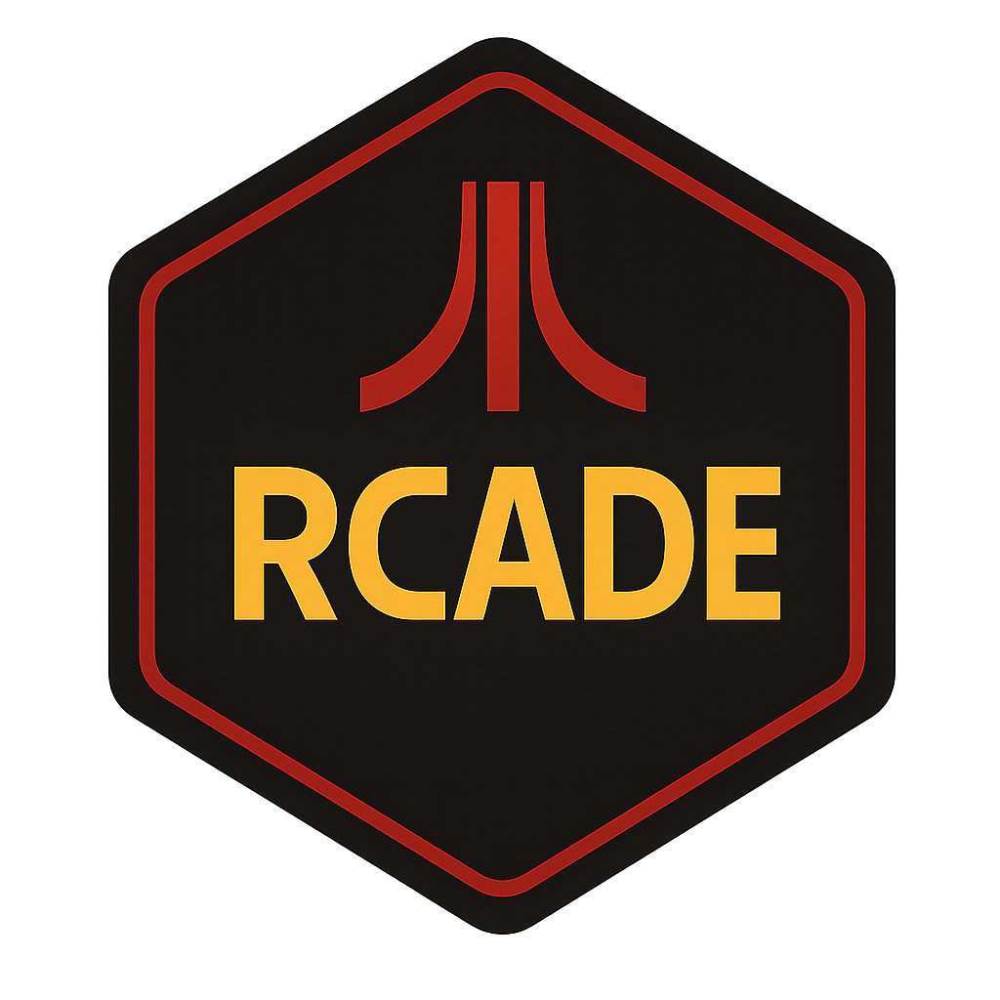

# 🎮 Rcade

**Rcade** is a retro-themed R package that launches a modular Shiny app featuring classic-style games and puzzles.


## 🕹️ Features

- **Tic Tac Toe** – A simple stylised version of the game.
- **Nonogram** – Logic puzzles with a pixel-art twist, including multiple difficulty levels.
- **Mini Cave Adventure** – A text-based, choice-driven adventure through a mysterious cave.
- **Space Invaders** - A Space Invaders "clone".
- **R Quest** - An R code-based adventure to reach the gaol.
- **Pong** - A remake of the classic pong game.

All games are implemented as Shiny modules for easy extension and maintenance.

---

## 🚀 Launch the App

To launch the full Rcade interface:

```r
# install.packages("devtools")
devtools::install_github("AlanInglis/Rcade")

library(Rcade)
launch_app()
```